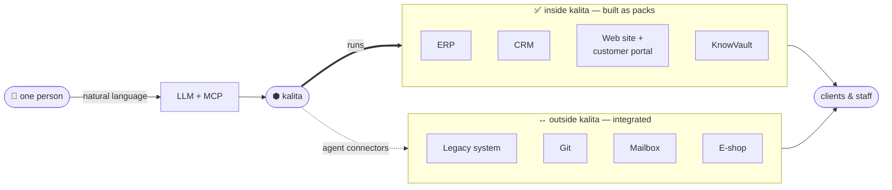
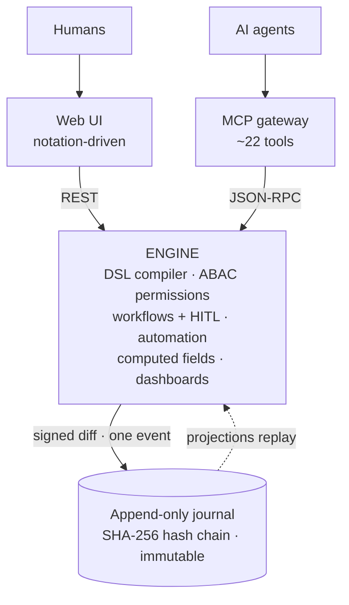
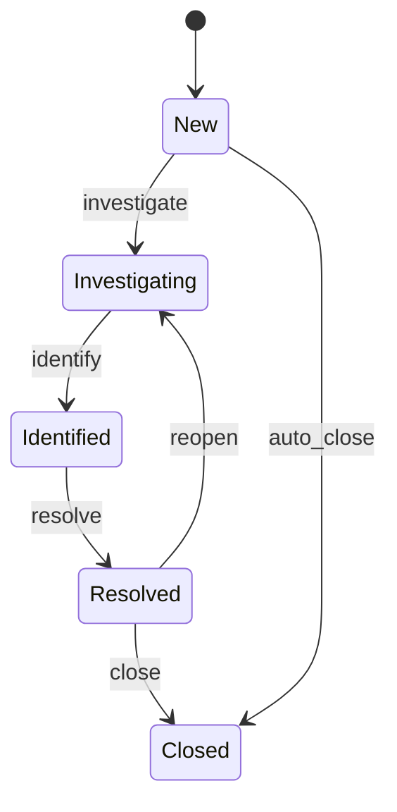
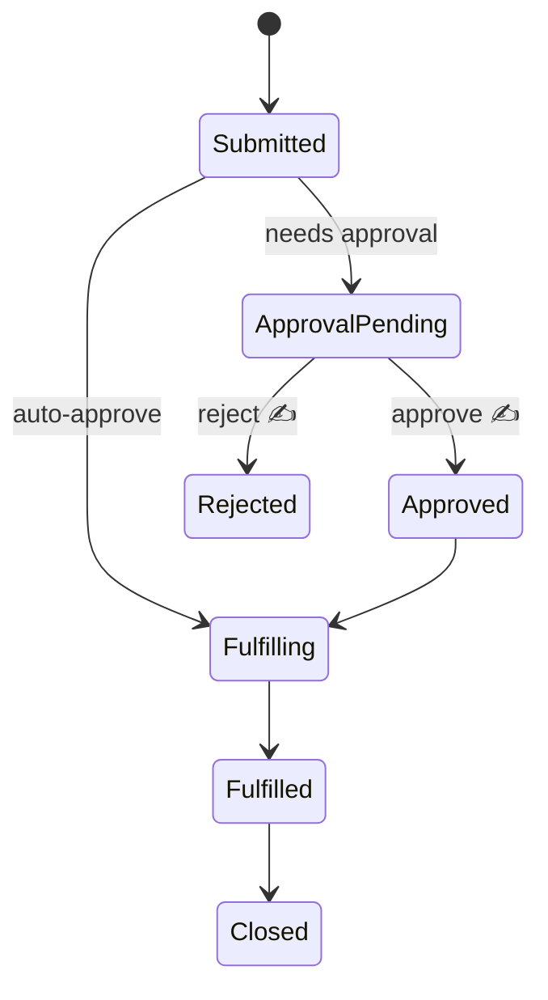
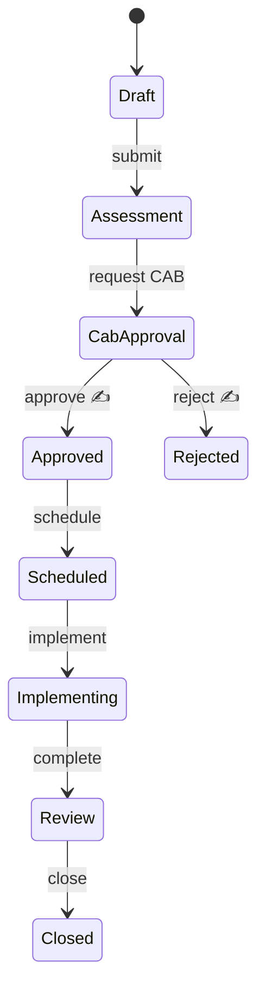

# Kalita

**An executable runtime for business systems in the agent era.**

> Agents and humans **describe** a business system in a constrained DSL —
> entities, workflows, permissions, automation, dashboards, UI. Kalita
> **executes the description directly** (no code generation): every change is a
> signed diff, every action is an event in a tamper-evident journal, every
> agent is an employee with an identity, permissions and an audit trail.

**Why.** LLM agents silently corrupt what they are trusted with when the artifact
is free-form (code, documents). Kalita replaces *welding* with *bricks*: a
grammar where drift does not compile, critical transitions require a human
signature, and nothing happens silently.

## The big picture

One person, amplified by an LLM over MCP, drives kalita from a single seat —
**replacing** the systems built on it and **orchestrating** the ones around it.
Both serve the company's clients and staff.



The boundary is the point. **Inside** kalita (the thick `runs` arrow): systems
you *build as packs* — ERP, CRM, the customer portal, KnowVault — where kalita
**is** the application. **Outside** (the dashed `connectors`): systems kalita
doesn't replace but reaches through agents — a legacy database, Git, a mailbox,
an e-shop. One operator covers the whole map.

## Inside one node



Humans and agents hit the **same engine** — same permission checks, same journal.
The DSL is a closed grammar, not arbitrary code, so the guarantees hold: a
permission can't fail open, an agent role without a `deny` block won't compile,
and the workflow state field can only move through declared transitions.

## The language, illustrated

A whole module is one `.dsl` file. Each entity declares its shape, its state
machine, its permissions and its dashboards — and the runtime executes that
description. Below, the language and the diagram it produces, side by side.

### Incident — fields, a live SLA, a workflow

```dsl
entity Incident:
    number:    serial format="INC-{year}-{seq:6}"
    title:     string required
    priority:  enum[P1, P2, P3, P4] default=P3
    source:    enum[Manual, Tivoli, Email, Portal] default=Manual
    assignee:  ref[core.User]
    sla_policy: ref[SLAPolicy]
    opened:    datetime default=$now
    # live SLA: minutes left before the linked policy's threshold is breached
    sla_left:  int computed = sla_policy.resolution_minutes - minutes_since(opened)
    status:    enum[New, Investigating, Identified, Resolved, Closed] default=New

workflow Incident on status:
    New           -> Investigating: investigate assignee=OperatorL2
    Investigating -> Identified:    identify
    Identified    -> Resolved:      resolve_incident
    Resolved      -> Closed:        close_incident
    Resolved      -> Investigating: reopen_incident
    New           -> Closed:        auto_close when source = Tivoli
```



### Human-in-the-loop — the ServiceRequest approval

A transition declared `requires approval(Role)` does not happen when an agent
calls it. It parks as **pending** (✍) until a human signs it — Ed25519,
offline-verifiable; the agent cannot rush it.

```dsl
workflow ServiceRequest on status:
    Submitted       -> ApprovalPending: require_approval when approval_required = true
    Submitted       -> Fulfilling:      auto_approve   when approval_required = false
    ApprovalPending -> Approved:        approve_request requires approval(Supervisor)
    ApprovalPending -> Rejected:        reject_request  requires approval(Supervisor)
    Approved        -> Fulfilling:      start_fulfillment
    Fulfilling      -> Fulfilled:       fulfill
    Fulfilled       -> Closed:          close_request
```



### Change — the CAB gate



### Dashboards — table-wide aggregates, ABAC-aware

```dsl
dashboard OperatorBoard "Operator queue":
    tile "Open incidents": count Incident where status != Closed and status != Resolved
    tile "SLA breached":   count Incident where sla_left < 0
    tile "By priority":    count Incident group by priority
```

Totals respect each viewer's row permissions: a manager sees the whole table, a
row-scoped user sees totals over only their own rows — no separate "see all" grant.

## What works today

| Area | Capability |
|------|-----------|
| **DSL compiler** | entities · rich types (money, email, file, `array[file]`, serial, duration…) · enums · refs & bidirectional links · workflows · ABAC permissions · automation · computed fields (arithmetic, aggregates, `days/hours/minutes_since`) · dashboards · i18n labels. Errors are `{code, file:line, message, fix_hint}` for agent self-correction. |
| **Runtime** | CRUD + validation · guarded workflow transitions & auto-moves · approval queue (signature-gated) · TTL task pool · automation triggers (schedule / event / stuck) · row-level ABAC on reads, writes **and** dashboard aggregates. |
| **Event store** | append-only PostgreSQL journal · SHA-256 hash chain · DB-level immutability · node-key checkpoints · definitions and projections replay from the journal. |
| **MCP gateway** | `~22` tools at `/mcp`. An agent starts from an empty node, iterates DSL to green via `validate_dsl`, `propose_change`s a pack, and works inside it after a human signs — that loop is the acceptance test. |
| **Generated UI** | one notation-driven client (no build step) renders any pack from per-actor metadata: lists, 3-column forms, kanban boards, record timelines, dashboards, the approval inbox, async people pickers. Invite-based customer portal with row-level visibility. |
| **core.User** | built-in people directory projected from the identity registry — `ref[core.User]` pickers search it; no User table per pack. |

## Quick start

```bash
# native (in-memory journal — dev only):
go build ./cmd/kalita
./kalita serve --pack packs/servicedesk --ui-dir web --demo
#   UI + REST : http://127.0.0.1:8080         (--demo prints a token per role)
#   MCP       : http://127.0.0.1:8080/mcp     (Authorization: Bearer <token>)

# with a real journal:
KALITA_PG_DSN=postgres://… ./kalita serve --pack packs/servicedesk

# compile-check a pack with agent-grade diagnostics:
./kalita check --pack packs/servicedesk
```

A module is a directory of `.dsl` files. `serve --demo` seeds a token per role
and an empty node accepts its first pack through `propose_change` + a signature.

## Modules & examples

Reference packs show how to run real domains on kalita, with zero domain code in
the kernel:

```
packs/servicedesk/   ITSM Service Desk — incidents, problems, changes, SLA, KB, CMDB
packs/crm/           Sales CRM — accounts, leads, pipeline, weighted forecast
packs/eshop/         Online store — catalog, master-detail orders, fulfilment
packs/devtrack/      Tracker where AGENTS do the tasks — assign → agent works → human accepts
packs/hr/            leave & balances        packs/tracker/   Jira-like issues
packs/knowvault/     RAG knowledge base      packs/boards/    simple boards
examples/collections, examples/dev_department, examples/pangram (every construct)
```

The headline is `devtrack`: a human files an issue, an **agent takes it from the
pool over MCP, does the work and submits, and a human accepts the result behind a
signature** — agents as audited, supervised employees. The platform mechanics
(task pool, leases, HITL, audit journal) are in the kernel; `workers/agent_runner`
is the reference loop that drives them. No ERP framework or tracker offers this
natively.

Each is built and exercised end-to-end through the MCP path (dogfood): the
Service Desk runs an ITSM flow with HITL on CAB approvals and live SLA timers,
the CRM rolls up a weighted sales forecast, the e-shop sums order lines into an
order total. KnowVault and the Service Desk are **separate products built on
kalita**, not parts of it.

## Design documents

[HLD](docs/HLD.md) · [DSL Spec](docs/DSL-SPEC-v0.md) ·
[MCP Contract](docs/MCP-CONTRACT-v0.md) · [Event Store](docs/EVENT-STORE-v0.md) ·
[Type System](docs/TYPE-SYSTEM-V1.md) · [Security threat model](docs/SECURITY.md)
*(read before deploying beyond localhost)* · [ADRs](docs/adr/)

## Layout

```
cmd/kalita/    single-binary entry point  (serve · check · agent/user add)
internal/      kernel: eventstore · dsl · engine · identity · api · mcp
web/           notation-driven UI (served from disk or embedded)
packs/         product modules — the kernel knows no domains
examples/      acceptance packs
docs/          design documents + ADRs
```

## Status

Pre-alpha. The MVP kernel is code-complete and the generated UI runs; the
Service Desk / HR / CRM cores build on it without kernel gaps. **Do not deploy
outside a trusted network** — see the P0 list in [SECURITY.md](docs/SECURITY.md).
